<!-- markdownlint-disable -->

# Ask-Me CLI

一个为 Cursor 的交互式命令行工具，实现持续工作循环模式。

## 功能特性

- 🔄 **持续工作循环** - Cursor AI 通过 ask-me 与用户交互，无需在聊天框等待
- 📝 **Markdown 历史记录** - 所有会话按项目和日期归档在 `~/.ask-me/projects/` 目录
- ✏️ **多编辑器支持** - 支持 VSCode、Cursor、Zed、Vim 等 15+ 编辑器
- 🎯 **跳转到行** - 自动定位到输入区域
- ⏱️ **超时提醒** - 4 分钟无输入时提供友好提示
- 🔍 **首次运行体验** - 自动检测编辑器并显示欢迎信息
- ✅ **设置验证** - 使用 Zod 验证配置文件
- 📦 **跨平台** - 支持 Windows、macOS、Linux

## 安装

### 使用 Bun（推荐）

```bash
# 克隆仓库
git clone https://github.com/HeiSir2014/ask-me.git
cd ask-me

# 安装依赖
bun install

# 全局链接
bun link
```

### 编译为独立可执行文件

```bash
# 当前平台
bun run compile

# 跨平台编译
bun run compile:windows  # Windows x64
bun run compile:linux    # Linux x64
bun run compile:macos    # macOS x64

# 编译所有平台
bun run compile:all
```

编译后的文件在 `dist/` 目录：

- `dist/windows-x64/ask-me.exe` - Windows
- `dist/linux-x64/ask-me` - Linux
- `dist/macos-x64/ask-me` - macOS (Intel)
- `dist/macos-arm64/ask-me` - macOS (Apple Silicon)

### 安装到系统 PATH

编译后运行：

```bash
# Windows (管理员权限)
.\dist\windows-x64\ask-me.exe install

# macOS/Linux
./dist/macos-x64/ask-me install
# 或
./dist/linux-x64/ask-me install
```

## 快速开始

### 1. 初始化 Cursor 规则

在项目目录中运行：

```bash
ask-me init
```

这会将 `ask-me.mdc` 安装到 `.cursor/rules/` 目录，启用持续工作模式。

### 2. 选择编辑器

```bash
# 查看可用编辑器
ask-me editor list

# 切换到 Cursor
ask-me editor use cursor

# 或使用自定义编辑器
ask-me editor set "code-insiders -r -w"
```

### 3. 开始使用

Cursor AI 会自动调用：

```bash
ask-me --cwd="/path/to/project" --title="Task completed" --context="Changes made..."
```

或使用短别名 `ask`：

```bash
ask --cwd="/path/to/project" --title="Task completed" --context="Changes made..."
```

## 命令参考

### 主命令

```bash
ask-me [--cwd="<path>"] [--title="<title>"] [--context="<context>"]
```

**注意**: 也可以使用短别名 `ask`，功能完全相同：

```bash
ask [--cwd="<path>"] [--title="<title>"] [--context="<context>"]
```

| 参数        | 必需 | 默认值   | 说明         |
| ----------- | ---- | -------- | ------------ |
| `--cwd`     | ❌   | 当前目录 | 工作目录路径 |
| `--title`   | ❌   | 空       | 会话标题     |
| `--context` | ❌   | 空       | 上下文信息   |

### 编辑器管理

```bash
# 列出所有可用编辑器
ask-me editor list

# 显示当前编辑器配置
ask-me editor current

# 切换到预设编辑器
ask-me editor use <name>

# 设置自定义编辑器
ask-me editor set "<command>"
```

### 初始化命令

```bash
# 初始化 Cursor 规则到当前项目
ask-me init
```

### 安装命令

```bash
# 安装 CLI 到系统 PATH（仅编译版本）
ask-me install
```

### 历史记录（即将推出）

```bash
# 查看会话历史
ask-me history
```

### 帮助

```bash
ask-me --help
ask-me editor --help
```

## 支持的编辑器

| 名称            | 命令                  | 平台                  |
| --------------- | --------------------- | --------------------- |
| `vscode`        | `code -r -w`          | Windows, macOS, Linux |
| `cursor`        | `cursor -r -w`        | Windows, macOS, Linux |
| `zed`           | `zed -r -w`           | Windows, macOS, Linux |
| `sublime`       | `subl -w`             | Windows, macOS, Linux |
| `vim`           | `vim`                 | Windows, macOS, Linux |
| `nvim`          | `nvim`                | Windows, macOS, Linux |
| `emacs`         | `emacs`               | Windows, macOS, Linux |
| `nano`          | `nano`                | macOS, Linux          |
| `helix`         | `hx`                  | Windows, macOS, Linux |
| `notepad++`     | `notepad++`           | Windows               |
| `textmate`      | `mate -w`             | macOS                 |
| `atom`          | `atom -w`             | Windows, macOS, Linux |
| `pulsar`        | `pulsar -w`           | Windows, macOS, Linux |
| `fleet`         | `fleet`               | Windows, macOS, Linux |
| `lapce`         | `lapce`               | Windows, macOS, Linux |
| `code-insiders` | `code-insiders -r -w` | Windows, macOS, Linux |

## 配置文件

配置保存在 `~/.ask-me/settings.json`：

```json
{
  "env": {
    "EDITOR": "cursor -r -w"
  },
  "editorPreset": "cursor",
  "gotoFormat": "-g {file}:{line}",
  "timeoutMinutes": 4
}
```

| 字段             | 说明             | 默认值             |
| ---------------- | ---------------- | ------------------ |
| `env.EDITOR`     | 编辑器命令       | `code -r -w`       |
| `editorPreset`   | 预设编辑器名称   | `vscode`           |
| `gotoFormat`     | 跳转行格式       | `-g {file}:{line}` |
| `timeoutMinutes` | 超时时间（分钟） | `4`                |

## 文件存储结构

会话历史按项目和日期归档：

```
~/.ask-me/
├── settings.json           # 配置文件
└── projects/
    └── g-project-ask-me/   # 项目目录（基于 CWD 路径）
        ├── latest.md       # 当前会话
        ├── 2025-12-19.md   # 归档会话
        └── 2025-12-18.md
```

### 路径映射规则

- `/home/user/project` → `home-user-project/`
- `C:\Users\dev\app` → `c-users-dev-app/`

### 文件格式示例

```markdown
# Project: /home/user/project

---

## Session: 2025-12-19 10:00:00

**Title**: DONE: 实现用户认证功能

**Context**:
summary: 完成 JWT 认证流程实现

changes:

- src/auth/jwt.ts (+120, -5)
- src/middleware/auth.ts (new)

next:

1. 添加测试
2. 更新文档
3. 其他

<!-- ✏️ 在此输入 | 💾 Ctrl+S 保存 | ❌ Ctrl+W 关闭 -->
```

## 工作流程



## 退出码说明

**所有退出码都是 0**（Cursor 集成要求）

| 场景               | stdout   | stderr       | 退出码 |
| ------------------ | -------- | ------------ | ------ |
| 有效输入           | 用户文本 | (空)         | 0      |
| 空输入（快速关闭） | (空)     | 快速关闭提醒 | 0      |
| 空输入（超时）     | (空)     | 超时提醒     | 0      |
| 错误               | (空)     | 错误信息     | 0      |

Cursor AI 通过检查 stdout 是否为空来判断用户是否提供了输入。

## 与 Cursor AI 集成

```bash
# Cursor AI 调用 ask-me 并捕获 stdout
USER_INPUT=$(ask-me --cwd="..." --title="..." --context="...")

# 检查用户是否提供了输入
if [ -z "$USER_INPUT" ]; then
  # 无输入 - 提醒消息已打印到 stderr
  # 代理应重试或相应处理
else
  # 收到有效输入 - 处理它
  echo "$USER_INPUT"
fi
```

## 故障排除

### 编辑器未找到

```
Error: Editor command 'cursor' not found.
```

**解决方案**：

1. 确保编辑器已安装并在 PATH 中
2. 使用 `ask-me editor use <name>` 切换到其他编辑器
3. 使用 `ask-me editor set "<command>"` 设置自定义命令

### 跳转行不工作

不同编辑器使用不同的跳转语法。如果自动检测不正确，编辑 `~/.ask-me/settings.json`：

```json
{
  "gotoFormat": "+{line} {file}"
}
```

常见格式：

- VSCode/Cursor: `-g {file}:{line}`
- Zed: `{file}:{line}:{column}`
- Vim/Nvim/Nano/Emacs: `+{line} {file}`
- Notepad++: `-n{line} {file}`
- TextMate: `-l {line} {file}`

### Windows 路径问题

ask-me 自动处理 Windows 路径：

- 反斜杠 `\` 转换为 `-`
- 冒号 `:` 被移除
- 大小写不敏感比较

### 设置文件损坏

如果 `~/.ask-me/settings.json` 损坏，ask-me 会自动重置为默认值并显示警告。

## 开发

```bash
# 运行开发版本
bun run start

# 构建
bun run build

# 编译
bun run compile
```

## 许可证

MIT
