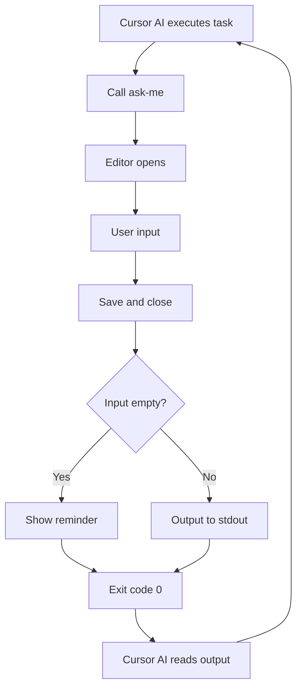

<!-- markdownlint-disable -->

# Ask-Me CLI

An interactive command-line tool for Cursor AI that enables continuous work loop mode.

---

**📖 Documentation Languages:**

- **English Version**: This document
- **中文版** (Chinese): [README.md](../README.md)

---

## Features

- 🔄 **Continuous work loop** - Cursor AI interacts via ask-me, no need to wait in chat
- ⏸️ **Smart pause mechanism** - Event-driven control based on Cursor Hooks
- 🪝 **Native hooks integration** - Monitor 9 Cursor events in real-time
- 📊 **Complete audit tracking** - Log all hook events to unified directory with session-level tracking
- 🔀 **Smart config merge** - Auto-preserve existing hooks with automatic priority sorting
- 📝 **Markdown history** - Archive all sessions by project and date in `~/.ask-me/projects/`
- ✏️ **Multi-editor support** - 15+ editors (VSCode, Cursor, Zed, Vim, etc.)
- 🎯 **Jump to line** - Auto-focus input area
- ⏱️ **Timeout reminders** - Friendly alert after 4 minutes of no input
- 🔍 **First-run experience** - Auto-detect editor and show welcome info
- ✅ **Settings validation** - Using Zod for settings validation
- 📦 **Cross-platform** - Windows, macOS, Linux

## Installation

### Using Bun (Recommended)

```bash
# Clone repository
git clone https://github.com/HeiSir2014/ask-me.git
cd ask-me

# Install dependencies
bun install

# Global link
bun link
```

### Compile to standalone executable

```bash
# Current platform
bun run compile

# Cross-platform compilation
bun run compile:windows  # Windows x64
bun run compile:linux    # Linux x64
bun run compile:macos    # macOS x64

# Compile all platforms
bun run compile:all
```

Compiled files are in `dist/` directory:

- `dist/windows-x64/ask-me.exe` - Windows
- `dist/linux-x64/ask-me` - Linux
- `dist/macos-x64/ask-me` - macOS (Intel)
- `dist/macos-arm64/ask-me` - macOS (Apple Silicon)

### Install to system PATH

After compilation, run:

```bash
# Windows (Administrator)
.\dist\windows-x64\ask-me.exe install

# macOS/Linux
./dist/macos-x64/ask-me install
# or
./dist/linux-x64/ask-me install
```

## Quick Start

### 1. Initialize Cursor Rules and Hooks

Run in your project directory:

```bash
ask-me init
```

This will:

- Install `ask-me.mdc` to `.cursor/rules/` directory, enabling continuous work mode
- Install hooks configuration to `.cursor/hooks.json` (supports pause checking)

#### Hooks Scope Options

```bash
# Project-level (recommended) - hooks affect current project only
ask-me init
# or explicitly specify
ask-me init --hooks project

# User-level - hooks affect all projects
ask-me init --hooks user

# Skip hooks installation
ask-me init --no-hooks
```

**Smart Configuration Merge**: ask-me automatically preserves your existing hooks configuration and places its own configuration first (highest priority).

### 2. Using Pause Feature

Pause AI execution at any time:

```bash
ask-me pause
```

Resume AI execution:

```bash
ask-me resume
```

Check current pause status:

```bash
ask-me hooks --status
# Output: paused or running
```

**How it works**:

- After running `ask-me pause`, creates `.cursor/.pause-signal` file
- Cursor hooks automatically check this file before each operation
- If file exists, AI immediately stops and waits for user input
- After user input (running `ask-me` main command or `ask-me resume`), automatically clears pause signal

### 3. Choose Editor

```bash
# List available editors
ask-me editor list

# Switch to Cursor
ask-me editor use cursor

# Or use custom editor
ask-me editor set "code-insiders -r -w"
```

### 4. Start Using

Cursor AI will automatically call:

```bash
ask-me --cwd="/path/to/project" --title="Task completed" --context="Changes made..."
```

Or use short alias `ask`:

```bash
ask --cwd="/path/to/project" --title="Task completed" --context="Changes made..."
```

## Command Reference

### Main Command

```bash
ask-me [--cwd="<path>"] [--title="<title>"] [--context="<context>"]
```

**Note**: You can also use short alias `ask`, with identical functionality:

```bash
ask [--cwd="<path>"] [--title="<title>"] [--context="<context>"]
```

| Parameter   | Required | Default     | Description         |
| ----------- | -------- | ----------- | ------------------- |
| `--cwd`     | ❌       | Current dir | Working directory   |
| `--title`   | ❌       | Empty       | Session title       |
| `--context` | ❌       | Empty       | Context information |

### Editor Management

```bash
# List all available editors
ask-me editor list

# Show current editor configuration
ask-me editor current

# Switch to preset editor
ask-me editor use <name>

# Set custom editor
ask-me editor set "<command>"
```

### Init Command

```bash
# Initialize Cursor rules and hooks to current project
ask-me init

# Specify hooks scope
ask-me init --hooks project   # Project-level (default)
ask-me init --hooks user      # User-level
ask-me init --no-hooks        # Skip hooks installation
```

### Pause/Resume Commands

```bash
# Pause AI execution (create .cursor/.pause-signal)
ask-me pause

# Resume AI execution (remove pause signal)
ask-me resume

# Check pause status
ask-me hooks --status
# Output: paused or running
```

### Hooks Command (Auto-called by Cursor)

```bash
# Check pause status and record audit log (auto-called by Cursor hooks)
ask-me hooks

# Manual status check (for user)
ask-me hooks --status
```

### Install Command

```bash
# Install CLI to system PATH (compiled version only)
ask-me install
```

### History (Coming Soon)

```bash
# View session history
ask-me history
```

### Help

```bash
ask-me --help
ask-me editor --help
```

## Supported Editors

| Name            | Command               | Platforms             |
| --------------- | --------------------- | --------------------- |
| `vscode`        | `code -r -w`          | Windows, macOS, Linux |
| `cursor`        | `cursor -r -w`        | Windows, macOS, Linux |
| `zed`           | `zed -r -w`           | Windows, macOS, Linux |
| `sublime`       | `subl -w`             | Windows, macOS, Linux |
| `vim`           | `vim`                 | Windows, macOS, Linux |
| `nvim`          | `nvim`                | Windows, macOS, Linux |
| `emacs`         | `emacs`               | Windows, macOS, Linux |
| `nano`          | `nano`                | macOS, Linux          |
| `helix`         | `hx`                  | Windows, macOS, Linux |
| `notepad++`     | `notepad++`           | Windows               |
| `textmate`      | `mate -w`             | macOS                 |
| `atom`          | `atom -w`             | Windows, macOS, Linux |
| `pulsar`        | `pulsar -w`           | Windows, macOS, Linux |
| `fleet`         | `fleet`               | Windows, macOS, Linux |
| `lapce`         | `lapce`               | Windows, macOS, Linux |
| `code-insiders` | `code-insiders -r -w` | Windows, macOS, Linux |

## Configuration File

Configuration is saved in `~/.ask-me/settings.json`:

```json
{
  "env": {
    "EDITOR": "cursor -r -w"
  },
  "editorPreset": "cursor",
  "gotoFormat": "-g {file}:{line}",
  "timeoutMinutes": 4
}
```

| Field            | Description         | Default            |
| ---------------- | ------------------- | ------------------ |
| `env.EDITOR`     | Editor command      | `code -r -w`       |
| `editorPreset`   | Preset editor name  | `vscode`           |
| `gotoFormat`     | Jump-to-line format | `-g {file}:{line}` |
| `timeoutMinutes` | Timeout in minutes  | `4`                |

## File Storage Structure

### Session History Storage

```
~/.ask-me/
├── settings.json           # Configuration file
└── projects/
    └── {normalized-cwd}/   # Project directory (based on CWD path)
        ├── latest.md       # Current session
        ├── 2025-12-21.md   # Archived sessions (by date)
        └── 2025-12-20.md
```

### Audit Log Storage (Hooks Integration)

```
~/.ask-me/
└── projects/
    └── {normalized-cwd}/
        └── {date}/         # Date directory
            ├── pause-data.json      # Pause metadata
            ├── pause-audit.log      # Pause audit log
            └── hooks-audit.jsonl    # Hook events audit log
```

### Project-Level Files

```
{project}/
├── .cursor/
│   ├── rules/
│   │   └── ask-me.mdc          # Cursor rules file
│   ├── hooks.json              # Hooks configuration
│   └── .pause-signal           # Pause signal file (exists when paused)
```

### Path Mapping Rules

- `/home/user/project` → `home-user-project/`
- `C:\Users\dev\app` → `c-users-dev-app/`
- All paths converted to lowercase, non-alphanumeric characters replaced with `-`

### File Format Example

```markdown
# Project: /home/user/project

---

## Session: 2025-12-19 10:00:00

**Title**: DONE: Implement user authentication

**Context**:
summary: Complete JWT authentication flow implementation

changes:

- src/auth/jwt.ts (+120, -5)
- src/middleware/auth.ts (new)

next:

1. Add tests
2. Update documentation
3. Other

<!-- ✏️ Input here | 💾 Ctrl+S save | ❌ Ctrl+W close -->
```

## Workflow



## Exit Code Explanation

**All exit codes are 0** (Cursor integration requirement)

| Scenario                  | stdout    | stderr               | Exit Code |
| ------------------------- | --------- | -------------------- | --------- |
| Valid input               | User text | (empty)              | 0         |
| Empty input (quick close) | (empty)   | Quick close reminder | 0         |
| Empty input (timeout)     | (empty)   | Timeout reminder     | 0         |
| Error                     | (empty)   | Error message        | 0         |

Cursor AI determines if user provided input by checking if stdout is empty.

## Integration with Cursor AI

### Continuous Work Loop

```bash
# Cursor AI calls ask-me and captures stdout
USER_INPUT=$(ask-me --cwd="..." --title="..." --context="...")

# Check if user provided input
if [ -z "$USER_INPUT" ]; then
  # No input - reminder message printed to stderr
  # Agent should retry or handle accordingly
else
  # Received valid input - process it
  echo "$USER_INPUT"
fi
```

### Hooks Integration Principle

ask-me uses Cursor's native hooks mechanism to implement pause functionality:

1. **Installation phase**: `ask-me init` creates `.cursor/hooks.json` configuration
2. **Trigger phase**: Cursor automatically calls `ask-me hooks` before/after 9 events
3. **Check phase**: hooks command reads stdin JSON, identifies event type via `hook_event_name`
4. **Decision phase**:
   - before hooks check pause status, return `permission: allow/deny`
   - after hooks record audit logs
   - beforeSubmitPrompt clears pause signal

### Monitored Hook Events

#### Before Hooks (Pause Check)

- `beforeShellExecution` - Before shell command execution
- `beforeMCPExecution` - Before MCP tool execution
- `beforeReadFile` - Before file read

#### After Hooks (Audit Logging)

- `afterShellExecution` - After shell command execution
- `afterMCPExecution` - After MCP tool execution
- `afterFileEdit` - After file edit
- `afterAgentThought` - After AI thought
- `afterAgentResponse` - After AI response

#### Control Hooks (Flow Control)

- `beforeSubmitPrompt` - Before user submit (clear pause signal)
- `stop` - At loop end

### Generated hooks.json Example

```json
{
  "version": 1,
  "hooks": {
    "beforeShellExecution": [
      { "command": "ask-me hooks" },
      { "command": "prettier --write" },
      { "command": "eslint ." }
    ],
    "afterShellExecution": [{ "command": "ask-me hooks" }],
    "beforeMCPExecution": [{ "command": "ask-me hooks" }],
    "afterMCPExecution": [{ "command": "ask-me hooks" }],
    "beforeReadFile": [{ "command": "ask-me hooks" }],
    "afterFileEdit": [{ "command": "ask-me hooks" }],
    "beforeSubmitPrompt": [{ "command": "ask-me hooks" }],
    "afterAgentThought": [{ "command": "ask-me hooks" }],
    "afterAgentResponse": [{ "command": "ask-me hooks" }]
  }
}
```

### Audit Log Format

```json
{
  "timestamp": "2025-12-21T12:53:56.334Z",
  "hook_event": "beforeShellExecution",
  "conversation_id": "abc123",
  "generation_id": "gen456",
  "model": "claude-3-sonnet",
  "cursor_version": "0.1.7",
  "command": "npm run build",
  "duration": 1234
}
```

## Troubleshooting

### Editor not found

```
Error: Editor command 'cursor' not found.
```

**Solutions**:

1. Ensure editor is installed and in PATH
2. Use `ask-me editor use <name>` to switch to other editor
3. Use `ask-me editor set "<command>"` to set custom command

### Jump to line not working

Different editors use different jump syntax. If auto-detection is incorrect, edit `~/.ask-me/settings.json`:

```json
{
  "gotoFormat": "+{line} {file}"
}
```

Common formats:

- VSCode/Cursor: `-g {file}:{line}`
- Zed: `{file}:{line}:{column}`
- Vim/Nvim/Nano/Emacs: `+{line} {file}`
- Notepad++: `-n{line} {file}`
- TextMate: `-l {line} {file}`

### Windows Path Issues

ask-me automatically handles Windows paths:

- Backslashes `\` converted to `-`
- Colons `:` removed
- Case-insensitive comparison

### Corrupted Settings File

If `~/.ask-me/settings.json` is corrupted, ask-me will automatically reset to defaults and show a warning.

## Development

```bash
# Run development version
bun run start

# Build
bun run build

# Compile
bun run compile
```

## License

MIT
